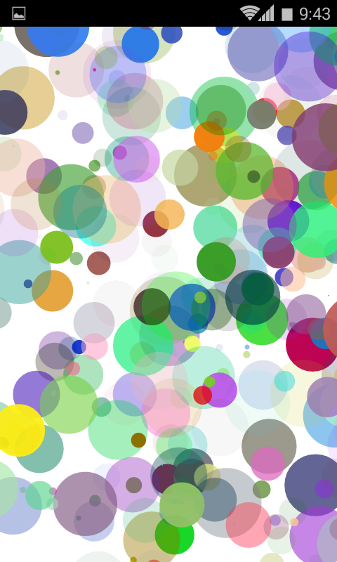

# Together

We are all artist.

## Authors

* Yuexi Dong
* [Jingtao He](http://blog.virtao.org)

## Description

Everyone has his own behaviors and habits. But we become similar when using smart phones. We spend a lot time on phone screen and always keep an eye on our mobile phone even without the important thing. Smart phones gradually make us become no characteristics and reduce the communication between people. In fact, we often play with our mobile phone, hold it, shake it and flip it. I hope to use these gestures to create art instead of simply creating information through the screen, so that the way we using mobile phone could be more interesting. As a designer, I has also been involved in arts. I am very willing do creations with my friends. I believe that each of us has capability to do artistic creation. Google provides us with a platform for the creation of art and narrows the distance between people.

I hope that people in different places on earth could be gathered together create of their own art works. I hope when creating the application platform, once people connected with it, they can create art works together. People who click to join this platform in certain unit time will be paired as a team. They will create some movie works together, including voice and images.

First , divide the world map and each GPS coordinates should correspond to the respective color ( within a fixed time , if a person were displaced , and the color which he corresponding to is gradient) . In certain unit time, each participant will use the phone gyroscope data to describe the trajectory of the color which represents him and the volume of the choice chosen by him. Finally, all the data of the participants will be uploaded to synthesize a digital image art work which will display on the platform. If there are 10 people participate and pair at the same time, it will appear a audio synthesized with 10 tracks and a video formed with 10 constantly changing colors. The head portraits ​​of all participants will form the cover of the art work.

## Link to Prototype

[Prototype APK Link](project_code/TogetherDemo.apk)

## Images & Videos

## Github

[Link](https://github.com/virtao/Together)
