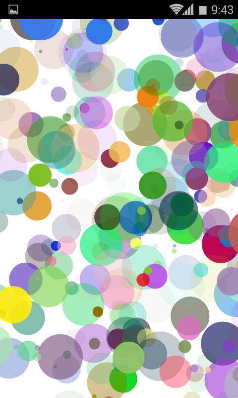

Due to reasons of time, we just realized the prototype server and client. All data are simulated.

Data simulate code:

```
	public static BokehPoint randomBokeh() {
		BokehPoint ret = new BokehPoint(random.nextInt(1600) - 200,
				random.nextInt(1600) - 200, random.nextInt(1600) - 200,
				random.nextInt(1600) - 200, random.nextInt(9000) + 1000, 50 * random.nextFloat(), new Color(
						random.nextInt(256), random.nextInt(256),
						random.nextInt(256), random.nextInt(256)), new Color(
						random.nextInt(256), random.nextInt(256),
						random.nextInt(256), random.nextInt(256)));
		return ret;
	}
```

The final result:



The demo apk is [HERE](../project_code/TogetherDemo.apk).